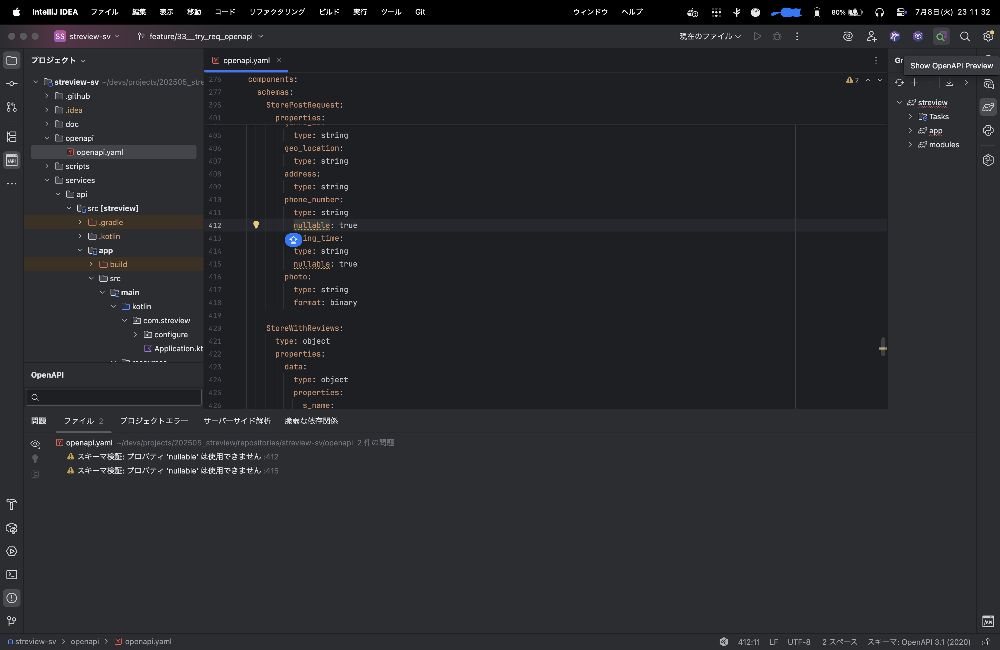
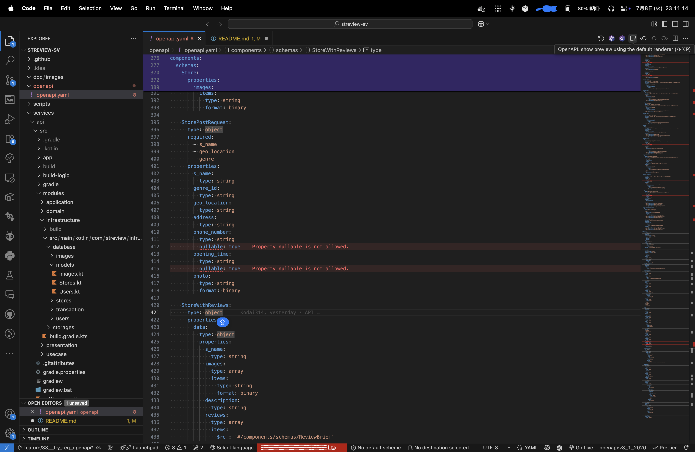

# streview-sv

すとれびゅ！のdockerプロジェクト  
[mobileのリポジトリ](https://github.com/kimetaato/streview-mobile)  

## 開発環境構築

1. .envファイル作成
2. Dockerプロジェクト

    ```bash
    # デバッグ用のオレオレ認証のための鍵作成
    bash ./scripts/gen_key.sh

    # コンテナビルド&実行
    bash ./scripts/rebuild.sh
    ```

3. Ktor
   1. firebaseで秘密鍵を生成し、`./streview-sv/services/api/src/app/src/main/resources/admin.json`に配置
4. ※現状はデバッグ用のコマンドでコンテナが動いていないのでコンテナに入って`cd /app/src && ./gradlew run`を実行

## デバック

### Postgresコンテナでの操作

```bash
# ログイン
psql -U root -d streview

# DB一覧
\l

# DB選択
\c streview

# テーブル一覧
\dt

# 終了
\q
```

### APIモックコンテナ

compose起動したら自動的に立ち上がっている  
後述のswaggerなどで、APIサーバが未完でもクライアントのテストなど行える  

### OpenAPIファイルを使ったリクエスト

`./openapi/*`を使ってAPIサーバのテストを行うことができる  

- [OpenAPI ​(Swagger)​ Editor InteliJ版](https://plugins.jetbrains.com/plugin/14837-openapi-swagger-editor)
- [OpenAPI (Swagger) Editor VSCode版](https://marketplace.visualstudio.com/items?itemName=42Crunch.vscode-openapi)

これらのツールをインストールし、Swaggerのビューを開き、各エンドポイントの`Try it`からテストできる

ビューの開き方はそれぞれ右上のボタンから



